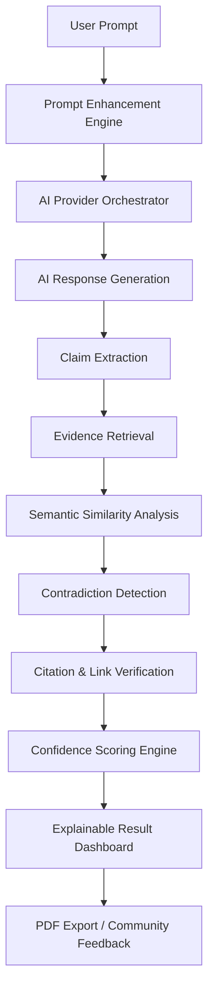
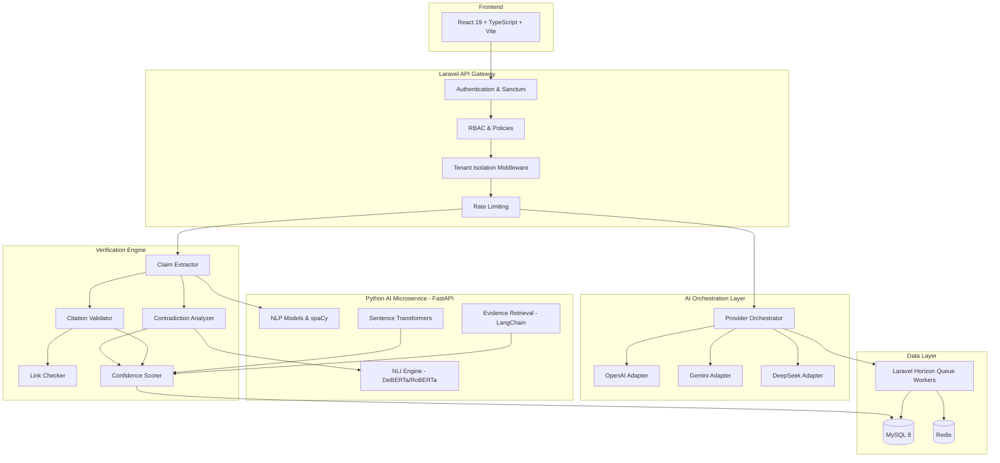

<p align="center">
  
</p>

<h1 align="center">🛡️ Humanova</h1>

<p align="center">
  <strong>AI Trust Governance & Verification Platform</strong><br/>
  <em>Detect hallucinations · Verify citations · Score confidence · Orchestrate AI providers</em>
</p>

<p align="center">
  
  
  
  
  
  
  
  
  
  
</p>

---

## 📖 Project Overview

**Humanova** is a next-generation, multi-tenant **AI Trust Governance & Verification Platform** designed to detect hallucinations in AI-generated content, verify citations and URLs, provide explainable confidence scoring, optimize prompts, and orchestrate multiple AI providers — all within an enterprise-grade SaaS architecture.

The platform combines AI verification intelligence, explainable scoring systems, community-driven validation, enterprise governance, prompt optimization, and AI provider orchestration into a unified, scalable ecosystem.

> **Positioning:** Humanova is an *"AI Trust Infrastructure Platform"* — not a simple hallucination checker.

---

## 🧩 Problem Statement

Modern AI systems frequently generate:

- 🔴 Fabricated facts and fake entities
- 🔴 Invalid or fake citations
- 🔴 Broken or nonexistent URLs
- 🔴 Contradictory information
- 🔴 Misleading confidence in unverified claims

These hallucinations create critical risks across **research, education, journalism, software development, enterprise automation, healthcare, and legal workflows**.

Current AI systems lack:

- Explainable verification pipelines
- Transparent trust scoring
- Collaborative hallucination intelligence
- Enterprise-level AI governance

**Humanova addresses these gaps.**

---

## 🎯 Objectives

| Objective | Priority |
| :--- | :--- |
| Detect hallucinated AI outputs | Critical |
| Provide explainable trust scoring | Critical |
| Verify citations & external links | Critical |
| Optimize prompts intelligently | High |
| Reduce AI token costs | High |
| Support organization-level collaboration | High |
| Provide enterprise analytics dashboards | High |
| Build hallucination intelligence datasets | High |

---

## 🚀 Implementation Status (May 2026)

**Backend Architecture: Fully Implemented (Phases 1-8)**

- ✅ Multi-tenant Laravel core with Role-Based Access Control (RBAC).
- ✅ 35+ database schemas for AI verification, telemetry, and metrics.
- ✅ AI Provider Abstraction layer (OpenAI, Gemini, DeepSeek).
- ✅ Asynchronous Pipeline (Horizon) for Claim Extraction, Evidence Retrieval, and Confidence Scoring.
- ✅ Containerized stack (Docker, Nginx, Redis) with a standalone Python FastAPI NLP microservice.

**Frontend Architecture: Scaffolded & UI Built**

- ✅ React 19 + TypeScript + Vite + Tailwind CSS stack established.
- ✅ Advanced, animated UI components built (Framer Motion, GSAP, Three.js).
- ✅ Core application layouts and dashboards structured.
- 🚧 Next Steps: API wiring and state management (Zustand) integration.

---

## ✨ Core Features

### 🔍 Hallucination Detection Engine

- Unsupported claims, fabricated statistics, fake citations
- Contradiction detection & outdated information analysis
- Fake entity identification
- Semantic similarity & NLI-based verification

### 📎 Citation Verification Engine

- URL existence & HTTP status validation
- DOI & CrossRef verification
- Metadata validation & SSL checks
- Citation authenticity scoring

### 🔗 Broken Link Checker

- Async URL verification with queue support
- Redirect chain analysis
- DNS existence validation
- SSRF-protected scanning (localhost/private IP blocking)

### 🔑 Uncertainty Keyword Scanner

- Detects hedging language and uncertainty markers
- Severity scoring per keyword
- Occurrence counting and reporting

### 🧠 Prompt Enhancement Engine

- **Modes:** Academic, Coding, Business, Marketing, Legal, Medical
- Low-hallucination mode & low-token mode
- Structured-output mode (JSON/table)
- Before/after comparison with token estimates
- Version history for prompts

### 📊 Confidence Scoring Engine

- Multi-factor weighted scoring (semantic similarity, source authority, citation validity, contradiction severity, uncertainty, community validation)
- Explainable reasoning layer
- Color-coded confidence visualization (Emerald 90–100%, Cyan 70–89%, Amber 50–69%, Red <50%)

### 👥 Community Feedback Tracker

- Hallucination report submissions
- Voting system & evidence uploads
- Trusted verifier workflows
- Moderation queue with reputation system

### 📄 PDF Report Export System

- Branded, enterprise-grade PDF reports
- Scan reports, analytics summaries, moderation reports
- Async generation via queue workers
- Organization-level branding customization

### 📈 Analytics Dashboard

- Hallucination trends & frequency analytics
- AI provider performance comparison
- Token usage & cost tracking
- Organization activity & moderation insights
- Exportable reports with chart visualizations

---

## 🔄 AI Verification Workflow



---

## 🏗️ System Architecture Overview



---

## 🛠️ Tech Stack

### Frontend Architecture

| Technology | Purpose |
| :--- | :--- |
| React 19 | UI framework |
| Vite | Build tool with HMR |
| TypeScript | Type-safe development |
| React Router v7 | Client-side routing |
| Zustand | Client state management |
| TanStack Query | Server state & API caching |
| Tailwind CSS v4 | Utility-first styling |
| shadcn/ui | Accessible component library |
| Framer Motion | Animations & transitions |
| Recharts | Analytics visualizations |
| Lucide React | Icon system |
| React Hook Form + Zod | Form management & validation |
| React Dropzone | File uploads |
| react-pdf | PDF preview |

### Backend Architecture

| Technology | Purpose |
| :--- | :--- |
| Laravel 12 | API framework |
| PHP 8.3+ | Server language |
| Laravel Sanctum | Authentication (SPA + API tokens) |
| Laravel Horizon | Queue monitoring |
| Laravel Policies + Gates | Authorization & RBAC |
| Swagger / OpenAPI | API documentation |
| barryvdh/laravel-dompdf | PDF generation |

### AI & NLP Stack

| Technology | Purpose |
| :--- | :--- |
| FastAPI (Python) | AI microservice framework |
| HuggingFace Transformers | NLI & transformer models |
| sentence-transformers | Semantic embeddings |
| spaCy | Entity extraction & NLP |
| NLTK | Text processing |
| LangChain | Retrieval architecture |
| DeBERTa-v3 / RoBERTa MNLI | Contradiction detection |
| MiniLM | Lightweight embeddings |
| tiktoken | Token estimation |

### Database Architecture

| Technology | Purpose |
| :--- | :--- |
| MySQL 8 | Primary relational database |
| Redis | Queues, cache, session management |
| pgvector / OpenSearch | Future vector storage expansion |

---

## 🔐 Authentication & RBAC

### Authentication Methods

- Email/password login with bcrypt/argon2 hashing
- OAuth login (Google; GitHub planned)
- Email verification required before AI usage
- Session management with CSRF protection & secure cookies

### User Roles

| Role | Description |
| :--- | :--- |
| Guest | Public landing access only |
| User | Personal scans and prompt usage |
| Researcher | Advanced verification and analytics |
| Trusted Verifier | Approve hallucination reports |
| Moderator | Manage community reports |
| Organization Admin | Manage org users, API keys, analytics |
| Super Admin | Global platform management |

### Role-Permission Matrix

| Module | User | Researcher | Moderator | Org Admin | Super Admin |
| :--- | :--- | :--- | :--- | :--- | :--- |
| Scans | CRUD own | CRUD advanced | Review | Full org | Global |
| API Keys | Own only | Own only | — | Org-wide | Global |
| Reports | Own | Advanced | Moderation | Org-wide | Global |
| Moderation | — | — | Yes | Partial | Full |
| Analytics | Limited | Advanced | Moderate | Org-wide | Global |

---

## 🏢 Organization & Multi-User Support

Humanova supports a multi-tenant architecture:

```
Platform → Organization → Workspace → Users
```

Each organization has fully **isolated**:

- Scan history & verification results
- API keys & provider configurations
- Analytics dashboards & reports
- Moderation workflows & audit logs
- Usage statistics & billing data

---

## 🤖 AI Providers Supported

| Provider | Status | Models |
| :--- | :--- | :--- |
| OpenAI | ✅ MVP | GPT-4o |
| Google Gemini | ✅ MVP | Gemini 2.5 |
| DeepSeek | ✅ MVP | DeepSeek Chat |

**Provider Features:**

- Unlimited API key management per organization
- Provider prioritization & routing
- Automatic fallback on failure/timeout
- Token tracking & cost analytics
- Rate limit management & retry logic

---

## 📦 Installation Guide

### Prerequisites

- **Node.js** 20+
- **PHP** 8.3+
- **Composer** 2.x
- **Python** 3.11+
- **MySQL** 8.0+
- **Redis** 7+
- **Docker** (optional, for containerized deployment)

### Environment Variables

Create `.env` files for each service:

**Backend (`/backend/.env`)**

```env
APP_NAME=Humanova
APP_ENV=local
APP_KEY=base64:GENERATE_WITH_ARTISAN
APP_URL=http://localhost:8000

DB_CONNECTION=mysql
DB_HOST=127.0.0.1
DB_PORT=3306
DB_DATABASE=humanova
DB_USERNAME=root
DB_PASSWORD=your_db_password

REDIS_HOST=127.0.0.1
REDIS_PORT=6379

QUEUE_CONNECTION=redis
SESSION_DRIVER=redis
CACHE_STORE=redis

MAIL_MAILER=smtp
MAIL_HOST=your_smtp_host
MAIL_PORT=587
MAIL_USERNAME=your_email
MAIL_PASSWORD=your_email_password
```

**Frontend (`/frontend/.env`)**

```env
VITE_API_BASE_URL=http://localhost:8000/api/v1
VITE_APP_NAME=Humanova
```

**AI Service (`/ai-services/.env`)**

```env
FASTAPI_HOST=0.0.0.0
FASTAPI_PORT=8001
MODEL_CACHE_DIR=./models
```

### Running Frontend

```bash
cd frontend
npm install
npm run dev
```

### Running Backend

```bash
cd backend
composer install
php artisan key:generate
php artisan migrate --seed
php artisan serve
```

### Database Setup

```bash
# Create the MySQL database
mysql -u root -p -e "CREATE DATABASE humanova CHARACTER SET utf8mb4 COLLATE utf8mb4_unicode_ci;"

# Run migrations and seeders
cd backend
php artisan migrate --seed
```

### API Key Setup

1. Navigate to **Settings → API Keys** in the dashboard
2. Select an AI provider (OpenAI, Gemini, or DeepSeek)
3. Enter your provider API key
4. Keys are **AES-256 encrypted** before storage
5. Keys are displayed as masked values (e.g., `sk-****abcd`)

> ⚠️ **Important:** Never share or expose raw API keys. Humanova encrypts all keys at rest and never displays full key values.

---

## 🚀 Deployment Instructions

### Docker Deployment

```bash
# Build and start all services
docker-compose up --build -d

# Services started:
# - frontend    (React + Vite)
# - backend     (Laravel + PHP-FPM)
# - python-ai   (FastAPI)
# - mysql       (MySQL 8)
# - redis       (Redis 7)
# - nginx       (Reverse Proxy)
```

### Production Deployment

**MVP Target:** VPS deployment

**Future Expansion:**

- Kubernetes orchestration
- Scalable queue workers
- Cloud autoscaling
- CDN for frontend assets

> 🔗 **Deployment Link:** *To be added after production deployment.*

---

## 📁 Folder Structure

```
CSE4204-8C-T07-Humanova/
├── frontend/                    # React 19 + Vite + TypeScript
│   ├── src/
│   │   ├── app/                 # App configuration & providers
│   │   ├── components/          # Reusable UI components
│   │   ├── modules/             # Feature modules
│   │   ├── pages/               # Route pages
│   │   ├── services/            # API service layer
│   │   ├── hooks/               # Custom React hooks
│   │   ├── stores/              # Zustand state stores
│   │   ├── lib/                 # Utility libraries
│   │   ├── layouts/             # Layout components
│   │   ├── types/               # TypeScript types
│   │   └── utils/               # Utility functions
│   └── ...
├── backend/                     # Laravel 12 API
│   ├── app/
│   │   ├── Actions/             # Single-action classes
│   │   ├── Services/            # Business logic services
│   │   ├── Repositories/        # Data access layer
│   │   ├── Jobs/                # Queue job classes
│   │   ├── Policies/            # RBAC authorization
│   │   ├── Events/              # Event classes
│   │   ├── Listeners/           # Event listeners
│   │   ├── DTOs/                # Data transfer objects
│   │   ├── Modules/             # Feature modules
│   │   └── Traits/              # Shared traits
│   └── ...
├── ai-services/                 # Python FastAPI AI microservice
│   ├── models/                  # ML model definitions
│   ├── pipelines/               # Processing pipelines
│   ├── embeddings/              # Semantic embedding engines
│   ├── verification/            # Verification logic
│   ├── retrieval/               # Evidence retrieval
│   ├── scoring/                 # Confidence scoring
│   ├── providers/               # AI provider adapters
│   └── utils/                   # Utilities
├── database/                    # Migration & seed files
├── deployment/                  # Docker & deployment configs
├── docs/                        # Project documentation
├── testing/                     # Test suites
├── screenshots/                 # Application screenshots
├── LICENSE                      # MIT License
└── README.md                    # This file
```

---

## 📚 Documentation Structure

All project documentation is organized under the `/docs` directory:

| # | Document | Category |
| :--- | :--- | :--- |
| 01 | [Requirements Architecture](docs/01-foundation/01-requirements-architecture-document.md) | Foundation |
| 02 | [Functional Specification](docs/01-foundation/02-functional-specification-document.md) | Foundation |
| 03 | [Database Architecture](docs/01-foundation/03-database-architecture-document.md) | Foundation |
| 04 | [Product Requirements (PRD)](docs/01-foundation/04-product-requirements-document-prd.md) | Foundation |
| 05 | [Design Document](docs/01-foundation/05-design-document.md) | Foundation |
| 06 | [Tech Stack Document](docs/01-foundation/06-tech-stack-document.md) | Foundation |
| 07 | [System Architecture Diagrams](docs/02-system-architecture/07-system-architecture-diagram-document.md) | System Architecture |
| 08 | [API Specification](docs/02-system-architecture/08-api-specification-document.md) | System Architecture |
| 09 | [AI Verification Logic](docs/02-system-architecture/09-ai-verification-logic-specification.md) | System Architecture |
| 10 | [Security Architecture](docs/02-system-architecture/10-security-architecture-document.md) | System Architecture |
| 11 | [DevOps & Deployment](docs/02-system-architecture/11-devops-deployment-architecture-document.md) | System Architecture |
| 12 | [Queue & Async Processing](docs/02-system-architecture/12-queue-async-processing-architecture-document.md) | System Architecture |
| 13 | [Environment Configuration](docs/02-system-architecture/13-environment-configuration-document.md) | System Architecture |
| 14 | [Error Handling & Recovery](docs/02-system-architecture/14-error-handling-failure-recovery-document.md) | System Architecture |
| 15 | [UI/UX Component System](docs/03-frontend-design-system/15-ui-ux-component-system-document.md) | Frontend Design |
| 16 | [AI Provider Abstraction](docs/04-ai-intelligence-layer/16-ai-provider-abstraction-specification.md) | AI Intelligence |
| 17 | [Prompt Engineering System](docs/04-ai-intelligence-layer/17-prompt-engineering-system-specification.md) | AI Intelligence |
| 18 | [Knowledge Graph Intelligence](docs/04-ai-intelligence-layer/18-knowledge-graph-intelligence-layer-specification.md) | AI Intelligence |
| 19 | [Analytics & Reporting](docs/05-analytics-governance/19-analytics-reporting-specification.md) | Analytics & Governance |
| 20 | [Audit & Compliance](docs/05-analytics-governance/20-audit-compliance-specification.md) | Analytics & Governance |
| 21 | [Testing & QA Strategy](docs/05-analytics-governance/21-testing-qa-strategy-document.md) | Analytics & Governance |

---

## 📸 Screenshots

> *Screenshots will be added after the initial UI implementation is complete.*

<!-- 
Add screenshots here:


-->

---

## 🌐 API Architecture Summary

| API Group | Method | Endpoint | Description |
| :--- | :--- | :--- | :--- |
| **Auth** | POST | `/auth/register` | Register new user |
| **Auth** | POST | `/auth/login` | Login & get token |
| **Auth** | POST | `/auth/logout` | Logout |
| **Auth** | GET | `/auth/oauth/{provider}` | OAuth login |
| **Organizations** | POST | `/organizations` | Create organization |
| **Organizations** | POST | `/organizations/{id}/invite` | Invite member |
| **Organizations** | GET | `/organizations/{id}/members` | List members |
| **RBAC** | GET | `/roles` | List roles |
| **RBAC** | POST | `/users/{id}/assign-role` | Assign role |
| **Providers** | GET | `/providers` | List AI providers |
| **Providers** | POST | `/provider-keys` | Add API key |
| **Providers** | DELETE | `/provider-keys/{id}` | Delete API key |
| **Prompts** | POST | `/prompts/enhance` | Enhance prompt |
| **Prompts** | POST | `/prompts` | Save prompt |
| **Prompts** | GET | `/prompts/history` | Prompt history |
| **Generation** | POST | `/generate` | Generate AI response |
| **Generation** | POST | `/generate/compare` | Multi-provider compare |
| **Scans** | POST | `/scans` | Create hallucination scan |
| **Scans** | GET | `/scans/{id}` | Get scan result |
| **Scans** | GET | `/scans` | List scans |
| **Verification** | POST | `/verification/external` | Verify external text |
| **Verification** | GET | `/scans/{id}/claims` | Get extracted claims |
| **Verification** | GET | `/scans/{id}/evidence` | Get evidence sources |
| **Citations** | POST | `/verification/citations` | Verify citations |
| **Citations** | POST | `/verification/links` | Check links |
| **Confidence** | GET | `/scans/{id}/confidence` | Confidence breakdown |
| **Community** | POST | `/reports` | Report hallucination |
| **Community** | POST | `/reports/{id}/vote` | Vote on report |
| **Community** | POST | `/reports/{id}/evidence` | Submit evidence |
| **Analytics** | GET | `/analytics/dashboard` | Dashboard metrics |
| **Exports** | POST | `/exports/pdf` | Generate PDF report |

> **Base URL:** `https://api.humanova.ai/api/v1`
> **Auth:** Bearer token via Laravel Sanctum

---

## 🔒 Security Features

| Feature | Implementation |
| :--- | :--- |
| API Key Encryption | AES-256 encrypted at rest, masked display |
| Authentication | Sanctum tokens, bcrypt/argon2 hashing |
| RBAC | Hierarchical role-based access control |
| Tenant Isolation | org_id middleware on every query |
| SSRF Protection | Blocked localhost, internal IPs, metadata endpoints |
| Rate Limiting | Redis-backed throttle per endpoint |
| CSRF Protection | Mandatory on all state-changing requests |
| Session Security | Secure cookies, session rotation |
| Input Validation | Laravel Form Requests + Zod (frontend) |
| SQL Injection Prevention | Eloquent ORM, prepared statements only |
| File Upload Security | MIME validation, extension checks, size limits |
| Audit Logging | Immutable, append-only activity logs |
| CORS | Trusted frontend origins only |

---

## 📏 Scalability Goals

| Stage | Target | Strategy |
| :--- | :--- | :--- |
| MVP | 1,000 concurrent users | Single VPS + Redis queues |
| Scale Phase | 10,000+ users | Horizontal workers + caching |
| Enterprise | Multi-org scaling | Kubernetes + autoscaling |

**Scaling Mechanisms:**

- Redis-backed queue workers (Laravel Horizon)
- AI microservice horizontal scaling
- Analytics preaggregation for dashboard speed
- Provider response caching
- CDN for frontend asset delivery

---

## 🔧 Development Workflow

### Git Branch Strategy

| Branch | Purpose |
| :--- | :--- |
| `main` | Production-ready code |
| `develop` | Integration branch |
| `feature/*` | New feature development |
| `bugfix/*` | Bug fixes |
| `hotfix/*` | Critical production fixes |
| `release/*` | Release candidates |

### CI/CD Pipeline (GitHub Actions)

```
Git Push → Linting → Testing → Docker Build → Deployment
```

| Step | Tool |
| :--- | :--- |
| Linting | ESLint, Prettier, PHP CS Fixer |
| Testing | Vitest, PHPUnit, PestPHP |
| Build Verification | Docker build validation |
| Deployment | GitHub Actions → VPS |

---

## 🤝 Contribution Guidelines

1. **Fork** the repository
2. **Create** a feature branch (`feature/your-feature-name`)
3. **Follow** the existing code style and conventions
4. **Write** tests for new features
5. **Submit** a pull request to the `develop` branch
6. **Ensure** all CI checks pass before requesting review

### Code Standards

- **Frontend:** ESLint + Prettier, TypeScript strict mode
- **Backend:** PSR-12, Laravel conventions
- **AI Service:** PEP 8, type hints

---

## 🧪 Testing Overview

| Layer | Framework | Scope |
| :--- | :--- | :--- |
| Frontend Unit | Vitest + React Testing Library | Components, hooks, utilities |
| Backend Unit | PHPUnit + PestPHP | Services, repositories, policies |
| API Testing | Postman + Swagger | Endpoint validation |
| E2E Testing | Playwright | Full user flow testing |

---

## 🔮 Future Scope

| Feature | Description |
| :--- | :--- |
| Browser Extension | Chrome/Firefox extension for inline verification |
| Mobile Apps | iOS & Android applications |
| Enterprise SSO | SAML/OIDC enterprise authentication |
| Knowledge Graph | Hallucination pattern intelligence graph |
| Semantic Clustering | Automatic hallucination category clustering |
| Adaptive Scoring | ML-based scoring model improvement |
| AI Observability | Real-time AI provider monitoring |
| Public APIs & SDKs | Third-party developer integration |
| 2FA | Two-factor authentication |
| Vector Search | pgvector / OpenSearch for semantic retrieval |

---

## 👥 Team Information

| Name | Student ID | Role |
| :--- | :--- | :--- |
| **MD Robayet Hassan Rupom** | 11220320979 | Frontend Developer & Team Leader |
| **Bushra Monzur Moumi** | 11220321048 | AI Integration Lead |
| **Aqib Jawwad Nahin** | 11220320969 | Backend Developer & Database Manager |

---

## 🏫 Course Information

| Detail | Value |
| :--- | :--- |
| **Course** | CSE 4204 — Mobile Computing Lab |
| **Section** | 8C |
| **Team** | CSE4204-8C-T07 |
| **Institution** | Northern University of Business and Technology Khulna |
| **Project Type** | AI Hallucination Detection & Verification System |

---

## 📄 License

This project is licensed under the **MIT License** — see the [LICENSE](LICENSE) file for details.

```
MIT License © 2026 CSE4204-8C-T07 — Humanova Team
Northern University of Business and Technology Khulna
```

---

<p align="center">
  <strong>Built with ❤️ by Team CSE4204-8C-T07</strong><br/>
  <em>Humanova — Advancing AI Trust & Governance</em>
</p>
